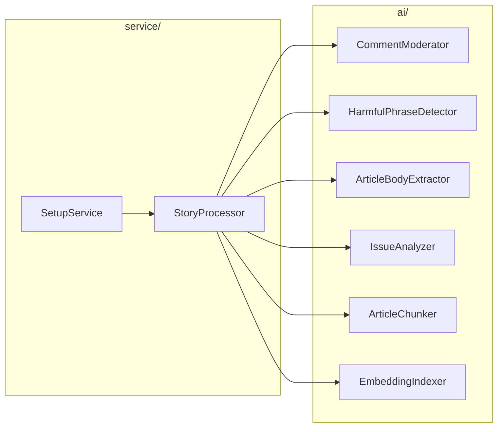
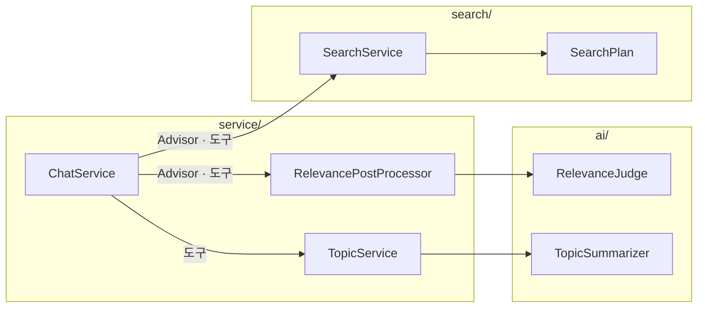
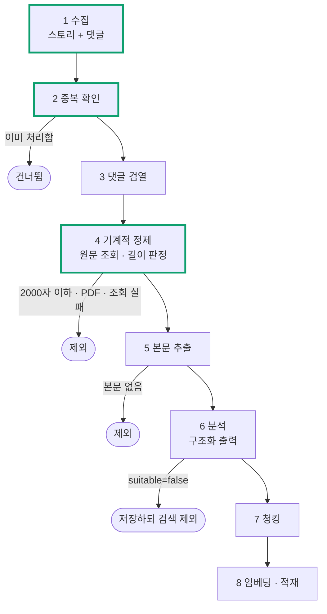
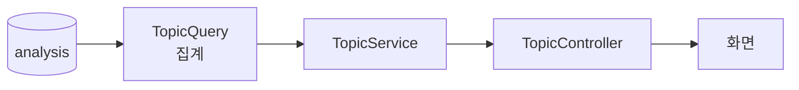
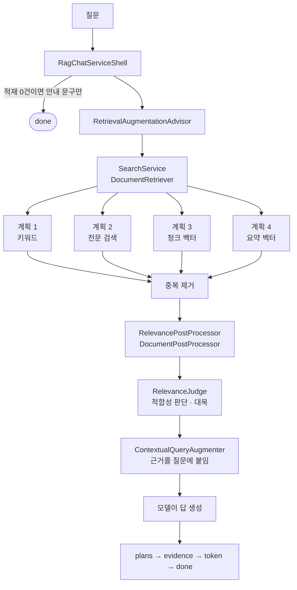
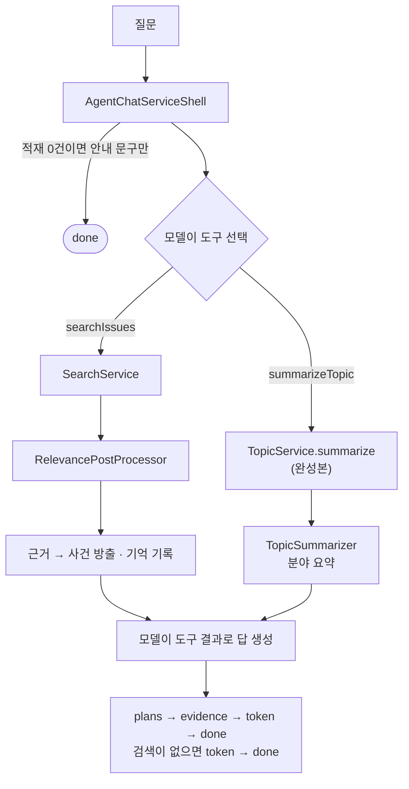
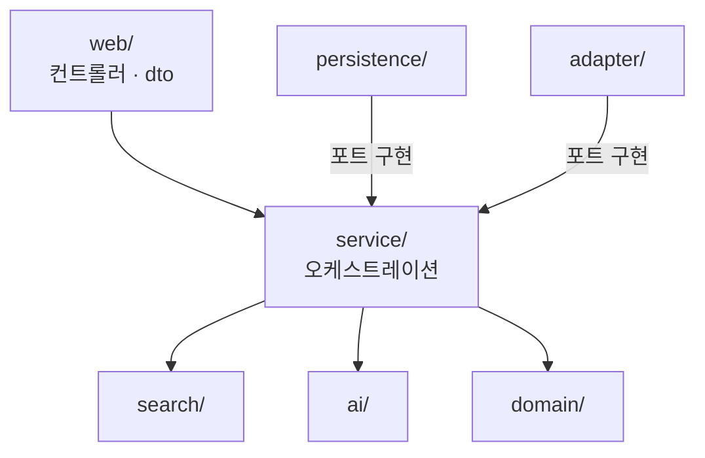
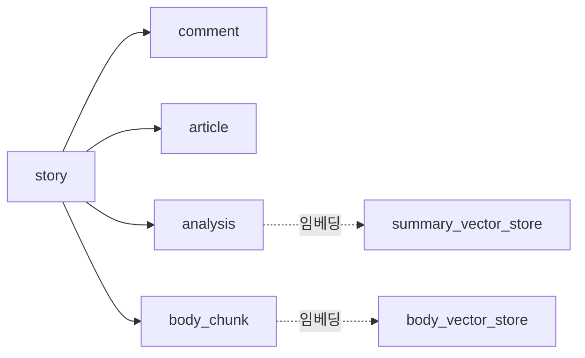

# 02. 전체 구조

빈 구현은 여러 패키지에 흩어져 있지만, **데이터 흐름**을 알면 어느 것부터 구현해도 됩니다.

---

## 인터페이스 구성

패키지가 서로를 어떻게 부르는지 **인터페이스만으로** 봅니다. 호출은 셋업과 Q&A
두 갈래이고, 둘 다 화살표가 `service/` 에서만 나갑니다.

**셋업**



`search/` 가 나오지 않습니다. 셋업은 검색을 쓰지 않습니다. `SetupService` 는 스토리
목록을 돌리기만 하고, **모델 호출은 전부 `StoryProcessor` 아래에 모여 있습니다.**
`StoryProcessor` 는 완성본이고, 인덱싱의 E · T · L 을 `StoryExtractor` · `StoryTransformer` ·
`StoryLoader` 에 나눠 맡깁니다. `ai/` 부품을 부르는 것은 `StoryTransformer`(3~7단계)와
`StoryLoader`(8단계 적재)입니다.

**Q&A**



`SearchService` 와 `RelevancePostProcessor` 는 Spring AI 의 RAG 부품입니다.
`SearchService` 는 `DocumentRetriever`, `RelevancePostProcessor` 는 `DocumentPostProcessor` 입니다.
두 부품을 누가 부르는지가 `ChatService` 구현마다 다릅니다.

- **1단계 `RagChatServiceShell`: Advisor.** 두 부품을 `RetrievalAugmentationAdvisor` 에 넘깁니다.
  Advisor 가 **질문마다** 검색하고 판단한 뒤 근거를 질문에 붙입니다.
- **2단계 `AgentChatServiceShell`: 도구.** Advisor 대신 `IssueTools` 를 등록합니다. 그 안의 `searchIssues` 가
  같은 두 부품을 부릅니다. 이제 **검색할지를 모델이 정합니다.** `TopicService` 도 도구로 불립니다.

답변 규칙은 두 구현이 각자 system 프롬프트로 넣습니다. 2단계 구현에 `@Primary` 를 붙이면
`ChatController` 가 그 구현을 주입받습니다.

**`ai/` 와 `search/` 에서 나가는 화살표는 없습니다.** 필요한 값은 전부 인자로 받습니다.
이 규칙은 아래 「계층」에서 다시 다룹니다.

---

## 완성본과 빈 구현

이 저장소에는 두 종류의 코드가 섞여 있습니다.

| | 제공 방식 | 식별 기준 |
| --- | --- | --- |
| **완성본** | 그대로 사용 | 나머지 전부 |
| **빈 구현** | 직접 구현 | 클래스 이름이 `*Shell`, 또는 `BodyVectorPlan` · `SummaryVectorPlan` · `IssueTools` |

빈 구현은 일곱 곳에만 있습니다.

```
ai/shell/                 LLM · Moderation 호출 8개
search/shell/             검색 서비스 1개
search/plan/              벡터 검색 계획 2개
service/chat/RelevancePostProcessorShell   근거 후처리 1개
service/chat/IssueTools   모델이 호출하는 도구 7종
service/chat/RagChatServiceShell      Q&A 1단계: 질문마다 검색하는 RAG
service/chat/AgentChatServiceShell    Q&A 2단계: 도구와 기억을 쓰는 에이전트
```

**각 클래스의 Javadoc 이 명세입니다.** 무엇을 받아 무엇을 돌려줘야 하는지, 주의할
점이 거기 적혀 있습니다. 필요한 의존성은 생성자로 이미 주입되므로 빈(Bean) 설정을
새로 작성할 필요는 없습니다.

---

## 흐름 1: 셋업 파이프라인

「데이터 셋업」 탭의 버튼으로 시작합니다. 8단계를 거쳐 DB 를 채웁니다.



테두리가 굵은 단계가 완성본(수집 · 중복 확인 · 기계적 정제)이고 나머지는 빈 구현입니다.

| 단계 | 빈 구현 | 완성본 |
| --- | --- | --- |
| 1 수집 | | `StorySource`: 목록 조회와 댓글 트리 순회 |
| 2 중복 확인 | | `SetupQuery.isProcessed` |
| 3 댓글 검열 | `CommentModerator` · `HarmfulPhraseDetector` | |
| 4 기계적 정제 | | `ArticleSource`: 조회와 태그 제거 · `PipelinePolicy.check`: 길이 판정 |
| 5 본문 추출 | `ArticleBodyExtractor` | |
| 6 분석 | `IssueAnalyzer` | `AnalysisMapper`: 엔티티 변환 |
| 7 청킹 | `ArticleChunker` | |
| 8 적재 | `EmbeddingIndexer` | 벡터 스토어 2개 |

실행 · 진행 상황 · 로그는 완성본 `PipelineSetupService` 가 맡습니다. 스토리 하나를 2~8단계로 처리하는
`StoryProcessor`(`DefaultStoryProcessor`)도 완성본이고, 단계를 E · T · L 세 객체에 나눠 맡깁니다.

| 담당 | 단계 | 부르는 것 |
| --- | --- | --- |
| `StoryExtractor` (E) | 2 중복 확인, 스토리 · 댓글 수집 | `SetupQuery` · `StorySource` |
| `StoryTransformer` (T) | 3 검열 → 4 정제 → 5 본문 추출 → 6 분석 → 7 청킹 | `CommentModerator` · `HarmfulPhraseDetector` · `ArticleSource` · `ArticleBodyExtractor` · `IssueAnalyzer` · `ArticleChunker` |
| `StoryLoader` (L) | 8 저장 · 적재 | `SetupStore` · `EmbeddingIndexer` |

저장은 `StoryLoader` 가 마지막에 한 번에 합니다. 중간에 부품이 예외를 던지면 그 스토리는 아무것도
저장되지 않고 다음 실행에서 처음부터 다시 처리됩니다.

> **판정 결과와 무관하게 원본은 모두 저장합니다.** 제외된 스토리와 사유를 나중에
> 조회할 수 있어야 하기 때문입니다. 4단계에서 탈락한 스토리는 다음 단계로 넘어가지 않고,
> 6단계에서 부적합으로 판정된 것은 저장하되 검색에서 뺍니다.

---

## 흐름 2: 주제 탐색

**빈 구현이 없습니다. 모두 완성본입니다.**



완성본으로 제공하는 이유는 벡터도 LLM 도 쓰지 않는 메타데이터 집계라 Spring AI 학습
요소가 없기 때문입니다.

**그래서 이 탭으로 진척을 확인할 수 있습니다.** 셋업에서 분석 결과가 한 건이라도 저장되면
**이 탭의 잠금이 바로 해제됩니다.** 저장은 8단계(`StoryLoader`)에서 한 번에 하므로 본문 추출 ·
분석 · 청킹(5~7단계)까지 채워야 합니다. 적재(`EmbeddingIndexer`)가 비어 있어도 분석 행은 먼저 저장됩니다.

---

## 흐름 3: Q&A

질문을 받아 답변을 내보내기까지의 흐름입니다. `ChatService` 구현을 두 개 만듭니다.
1단계 `RagChatServiceShell` 은 질문마다 검색하는 RAG 이고, 2단계 `AgentChatServiceShell` 은 검색을 도구로 옮긴 에이전트입니다.

**1단계: 질문마다 검색하는 RAG**



**2단계: 도구와 기억을 쓰는 에이전트**



네 계획을 **전부** 수행하고 각각 상위 5건을 받습니다. 한 계획이 0건이어도 나머지 계획의
결과로 후보를 채웁니다. 2단계에서 모델이 분야나 원문 타입을 지정하면 모든 계획에 필터로 걸립니다.

**계획 1 은 사용자 원문을 봅니다.** 2단계에서 `searchIssues` 의 검색어는 모델이 다듬은
값이라, 사용자가 쓴 키워드가 문장으로 늘어나거나 번역돼 남지 않습니다. 그래서 `AgentChatServiceShell` 이
원문을 `toolContext` 로 넘기고, 계획 1 은 그 원문 안에서 저장된 키워드를 찾습니다.

**답은 근거를 받은 모델이 한 번에 생성합니다.** 1단계에서는 Advisor 가 근거를 질문에 붙이고,
2단계에서는 도구가 근거와 계획별 실행 조건을 돌려줍니다. 모델이 받는 근거 JSON 은 같습니다.

**점수는 합치지 않습니다.** 불리언 · `ts_rank` · 코사인 거리는 서로 비교할 수 없는
척도이기 때문입니다. 최종 순위는 `RelevanceJudge` 가 정합니다.

프론트엔드는 `plans` → `evidence` → `token` 순서로 이벤트를 받아 화면을 차례로 그립니다.
사이드바 검색 계획(계획별 건수와 실행 조건)이 먼저 채워지고, 근거 카드가 표시되고, 답변이 타이핑되듯 나타납니다.
계획별 건수는 `SearchService` 가 검색 컨텍스트(`Query` 의 context)에 기록한 값입니다.

---

## 계층

구현하다 보면 "왜 여기서 저걸 못 부르지?" 라는 의문이 생깁니다. 규칙이 하나 있습니다.

**안쪽 계층은 바깥쪽 계층을 모릅니다.**



- **`ai/` 와 `search/` 는 아무것도 참조하지 않습니다.** DB 도 도메인 엔티티도
  모릅니다. 필요한 것은 인자로 받습니다.
- **`service/` 는 `web/` 도 `persistence/` 도 모릅니다.** 바깥 세계와는 **포트**로만
  만납니다 (`StorySource` · `ArticleSource` · `SetupStore` 등). 그 구현은 인프라가 맡습니다.
- **`persistence/` 와 `adapter/` 의 화살표는 위를 향합니다.** DB 든 외부 API 든 똑같이
  바깥 세계이므로 한쪽만 예외로 두지 않습니다.

`LayeringTest` 가 이 규칙을 강제합니다. 어기면 `./gradlew test` 가 잡아냅니다.

---

## 데이터 저장 위치



| 테이블 | 내용 | 적재 단계 |
| --- | --- | --- |
| `story` · `comment` | 수집 원본 (댓글은 마스킹된 텍스트) | 1 · 3 |
| `article` | 원문 처리 결과. **이 행의 존재가 중복 확인 기준** | 4 · 5 |
| `analysis` | 분석 결과. `suitable` 이 검색 대상 여부 | 6 |
| `body_chunk` | 본문 청크 | 7 |
| `summary_vector_store` | 요약 임베딩 (스토리당 1행) | 8 |
| `body_vector_store` | 청크 임베딩 (스토리당 N행) | 8 |
| `SPRING_AI_CHAT_MEMORY` | 대화 기억 | Q&A |

벡터 스토어를 둘로 나눈 이유는 짧은 요약과 긴 청크가 같은 순위 경쟁을 하지 않게 하기
위해서입니다. 덕분에 "요약에서만 찾기" 같은 검색 계획을 세울 수 있습니다.

pgAdmin(http://localhost:5050) 에서 직접 들여다볼 수 있습니다.

---

## 다음 문서

[03. 구현](03-구현.md) 에 빈 구현마다 입력 · 출력 · 확인 방법이 정리돼 있습니다.
